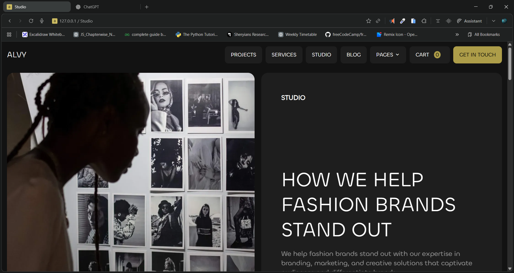
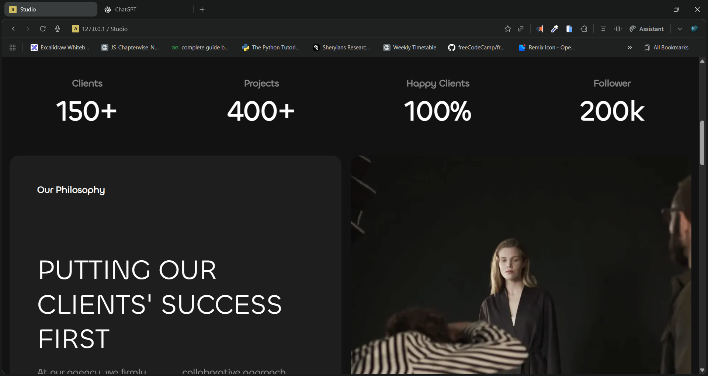
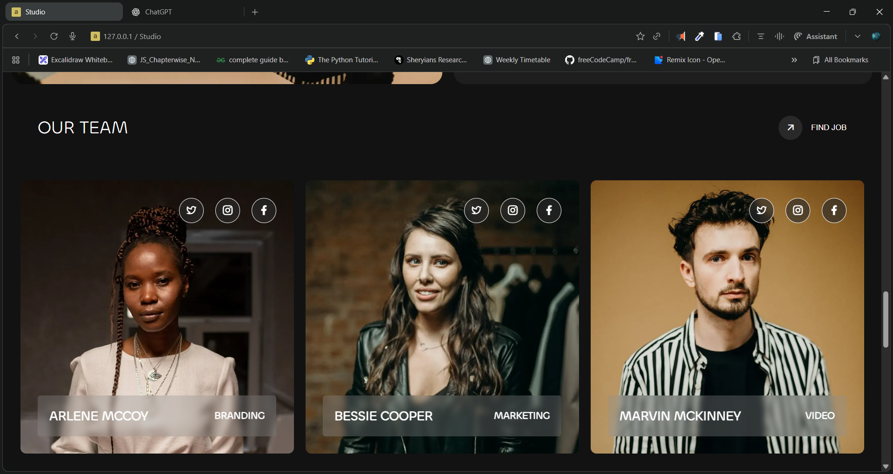
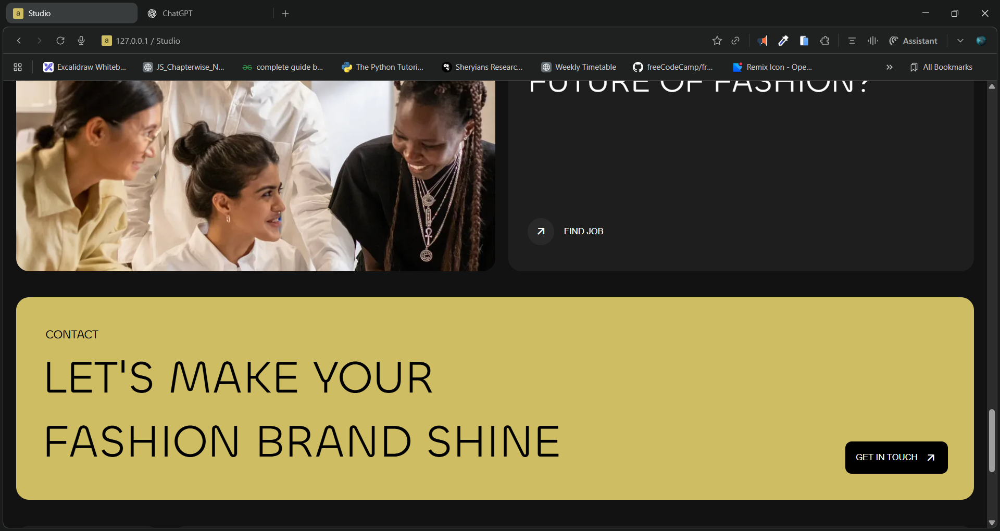
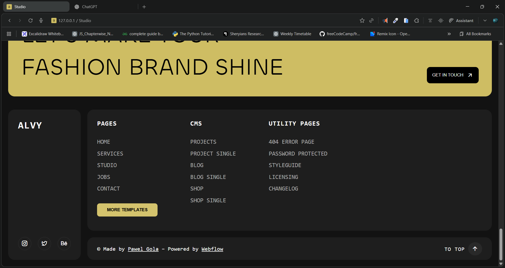

# 🌟 ALVY – Fashion Studio Website

A modern, elegant, and responsive **fashion branding studio website** built using **HTML5**, **SCSS**, and **Remix Icons**.
This project showcases a premium digital studio called **ALVY**, designed to help fashion brands stand out with creativity, innovation, and bold design.

---

## 🖼️ Preview

### 🔹 Homepage



### 🔹 Achievements



### 🔹 Team



### 🔹 Contact Section 



### 🔹 Footer



---

## 🎥 Demo Video

[▶ Watch Demo](./Screenshots/demo.mp4)

---

## 🌐 Live Demo

🔗 [Click here to view live project](https://anvy-studio-using-html-scss.netlify.app/)

---

## 🧩 Features

✨ **Fully Responsive Layout** – Optimized for desktop and mobile
🎨 **SCSS Styling** – Modular, clean, and easy to customize
⚡ **Modern UI Design** – Dark theme with high-contrast typography
👩‍💼 **Team Section** – Interactive team cards with social icons
📈 **Achievements Section** – Animated stats for clients and projects
📬 **Contact CTA** – Eye-catching “Get in Touch” call-to-action
🔗 **Footer Navigation** – Well-structured links and social handles

---

## 🧱 Tech Stack

| Technology                     | Purpose              |
| ------------------------------ | -------------------- |
| **HTML5**                      | Structure & Content  |
| **SCSS (CSS3)**                | Styling & Layout     |
| **Remix Icons**                | Iconography          |
| **Webflow Design Inspiration** | Design Reference     |
| **Responsive Web Design**      | Device Compatibility |

---

## 📂 Project Structure

```
Studio/
│
├── index.html          # Main HTML file
├── style.scss          # Main SCSS stylesheet
├── style.css           # Compiled CSS file (generated)
├── /Assets             # Images and icons
│   ├── image 1.webp
│   ├── image 2.webp
│   ├── image 3.webp
│   ├── image 4.webp
│   └── favicon.ico
└── /Screenshots        # Project screenshots (for README)
```

---

## 🚀 Getting Started

### 1️⃣ Clone this repository

```bash
git clone https://github.com/Dileep-kumawat/ANVY-studio-website-clone-using-html-and-scss.git
```

### 2️⃣ Open the project

```bash
cd ALVY-Studio
```

### 3️⃣ Run the project

Simply open `index.html` in your browser.

Or use a local server (optional):

```bash
npx live-server
```

---

## 🧠 Key Learnings

* Advanced **SCSS nesting** and variable management
* Creating responsive **grid and flex layouts**
* Designing minimal yet **aesthetic user interfaces**
* Effective **content hierarchy** and typography design

---

## 🖋️ Author

**👨‍💻 [Dileep Kumawat]**
Front-End Developer | UI/UX Enthusiast

- 📧 Email: [dileepkumawat525@gmail.com](mailto:dileepkumawat525@gmail.com)
- 🌐 LinkedIn: [https://www.linkedin.com/in/dileep-kumawat/](https://www.linkedin.com/in/dileep-kumawat/)
- 🐙 GitHub: [https://github.com/Dileep-kumawat](https://github.com/Dileep-kumawat)

---

## 📜 License

This project is licensed under the **MIT License** – feel free to use, modify, and share it with proper credit.